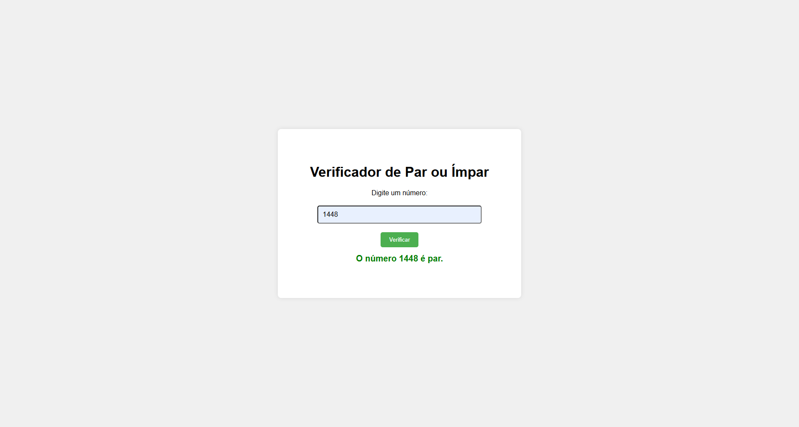
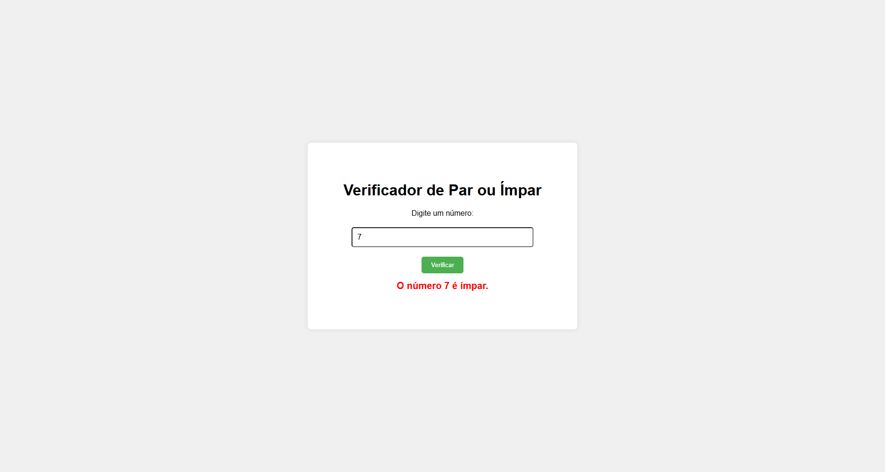

# Lógica de Programação - Exercício 1: Número Par ou Ímpar

Este repositório contém um exercício de lógica de programação criado para melhorar meu raciocínio lógico e habilidades de programação. 

## Sobre o Exercício

O objetivo deste exercício é criar um programa simples que permita ao usuário inserir um número e exibir se o número é par ou ímpar.

### Funcionalidades:
- O usuário digita um número.
- O sistema verifica se o número é par ou ímpar.
- Caso o valor inserido não seja um número válido, uma mensagem de erro será exibida.

## Screenshots

Aqui estão algumas imagens do projeto em funcionamento:

### Quando o número é par:

### Quando o número é ímpar:

## Tecnologias Utilizadas

- **HTML5**: Estrutura a página.
- **CSS3**: Estilização da interface.
- **JavaScript**: Lógica para verificar se o número é par ou ímpar.

## ❤️ Contato
claudiacostapaniago@gmail.com
